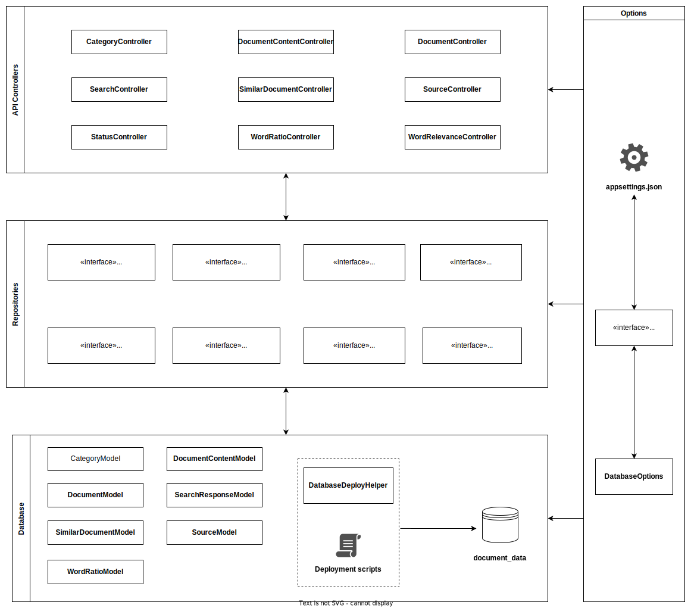

# DatabaseLayer_DocumentDataAPI (DLDDAPI)
<!-- DESCRIPTION -->
The DocumentDataAPI is the main interface to the `document_data` database schema, and provides endpoints to retrieve,
insert, update, and delete its contents. \
Besides the actual API, the project also includes a script with all table
definitions for the schema, as well as a tool to easily deploy this schema in any environment.

The API is set up as an [ASP.NET Core 6.0 web API](https://learn.microsoft.com/en-us/aspnet/core/tutorials/first-web-api?view=aspnetcore-6.0&tabs=visual-studio), and is therefore written in C#.

## Architecture


<p style="text-align: center;"><b>Fig.1 - Diagram of the DocumentDataAPI architecture</b><br><i>(as of November 2022)</i></p>

The API can be divided into the following segments:

- The **API Controllers** define the endpoints that other applications can use to access the `document_data` database. For example, the **SourceController** exposes the endpoint `GET https://localhost:8000/document-data-api/services` (assuming that the API is hosted locally on port 8000), 
which will return a list of all sources in the database in the JSON format. These controllers also perform most error handling, since they should be able to send appropriate responses to requests. E.g., if an error occurs while fulfilling a request, it will respond with a status `500 - Internal Server Error`.
- The **Repositories** provide methods to actually manipulate and retrieve data from the database. The API controllers use these repositories to fulfill requests. They are implemented as interfaces to allow for switching database providers as well as increased testability.
- The **Database** segment includes the various models of the database tables (i.e. the `SourceModel`, which is a model of the `sources` table). It also includes deployment scripts that the `DatabaseDeployHelper` uses to actually deploy the database schema with all tables to a database.
- The **Options** are used throughout the entire application, and simply provide the application settings. The setup is very typical for an ASP.NET Core application (see [this tutorial](https://learn.microsoft.com/en-us/aspnet/core/fundamentals/configuration/?view=aspnetcore-6.0)): In production mode, 
`appsettings.json` is used, and in development mode, `appsettings.Development.json` is used. However, for settings local to your machine, use `appsettings.local.json` which **is not** added to version control. This file will automatically be prioritized over the settings in the other files.

## Dependency Injection
The project is set up with [Dependency Injection](https://learn.microsoft.com/en-us/aspnet/core/fundamentals/dependency-injection?view=aspnetcore-6.0), which means that services should not be instantiated manually, but can instead be injected into a component through its constructor. As an example, 
consider the following snippet from the `WordRatioController`, which relies on the `IWordRatioRepository` to get data:
``` csharp
public class WordRatioController : ControllerBase
{
    private readonly IWordRatioRepository _repository;
    private readonly ILogger<WordRatioController> _logger;

    public WordRatioController(IWordRatioRepository repository, ILogger<WordRatioController> logger)
    {
        _repository = repository;
        _logger = logger;
    }
    ...
}
```
<p style="text-align: center;"><b>Fig. 2 - An example of dependency injection in the WordRatioController</b><br>(DocumentDataAPI/Controllers/WordRatioController.cs)</p>

Notice that the `IWordRatioRepository` is not instantiated, but instead injected through the constructor. When the controllers are automatically set up in `Program.cs`, 
these dependencies will also automatically be set up by the dependency injection system provided in ASP.NET Core. 
When a dependency is used such as the `IWordRatioRepository` above, it must simply be registered as a service when building the application in `DocumentDataAPI/Program.cs`, as shown below:

``` csharp
...
builder.Services
    .AddSingleton<DatabaseDeployHelper>()
    .AddSingleton<ISqlHelper, DapperSqlHelper>()
    .AddSingleton<IRelevanceFunction, CosineSimilarityCalculator>()
    .AddSingleton<IDbConnectionFactory>(_ => new NpgDbConnectionFactory(databaseOptions.ConnectionString))
    .AddScoped<IDocumentContentRepository, NpgDocumentContentRepository>()
    .AddScoped<IDocumentRepository, NpgDocumentRepository>()
    .AddScoped<ISourceRepository, NpgSourceRepository>()
    .AddScoped<IWordRatioRepository, NpgWordRatioRepository>()
    ...
...
```
<p style="text-align: center;"><b>Fig. 3 - Setting up services for dependency injection</b><br>(DocumentDataAPI/Program.cs)</p>

In line 10, the `IWordRatioRepository` is registered as a [scoped service](https://learn.microsoft.com/en-us/aspnet/core/fundamentals/dependency-injection?view=aspnetcore-6.0#service-lifetimes), and its implementation is the `NpgWordRatioRepository`. So in this case, 
this is the actual class that will be automatically injected into the `WordRatioController`. If we want to change this implementation to another class at a later point, we can simply replace it in this line without breaking anything in the components that use this dependency.

<!-- CONTACT -->
## Contact

Wiki: [https://wiki.knox.cs.aau.dk/en/Database/DocumentDataAPI/Introduction](https://wiki.knox.cs.aau.dk/en/Database/DocumentDataAPI/Introduction) \
Project Link: [https://github.com/Knox-AAU/DatabaseLayer_DocumentDataAPI/](https://github.com/Knox-AAU/DatabaseLayer_DocumentDataAPI/)

<!-- AUTHORS -->
### Authors
#### 2022
Kasper Kaputu Henningsen (khenni20@student.aau.dk) \
Mikkel Raakjær Stidsen (mstids20@student.aau.dk) \
Nicolai Hejlesen Jørgensen (njarge20@student.aau.dk) \
Nikolaj Dam (ndam20@student.aau.dk) \
Sarmilan Tharmabalan (stharm20@student.aau.dk) \
Tobias Lausten (tlaust18@student.aau.dk)